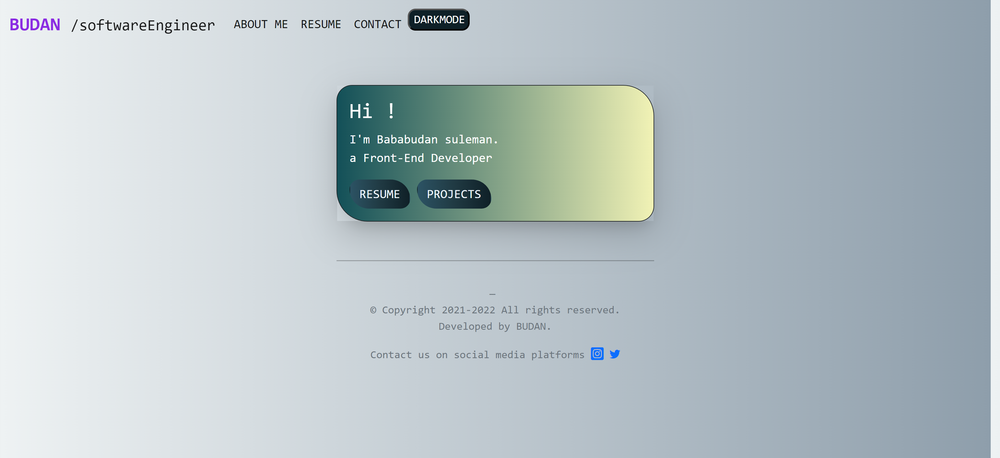
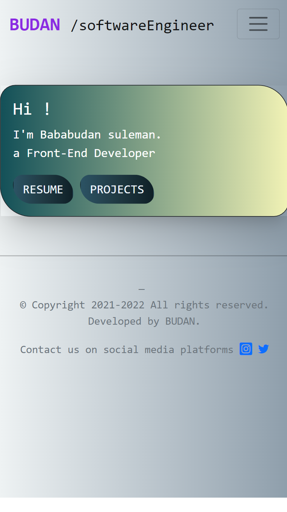
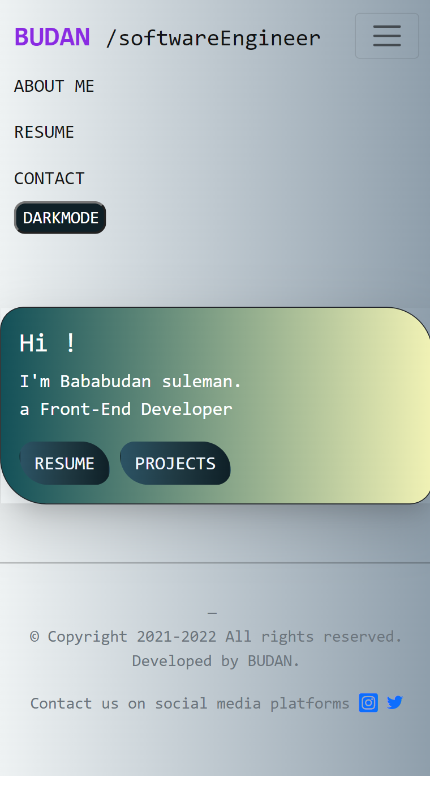
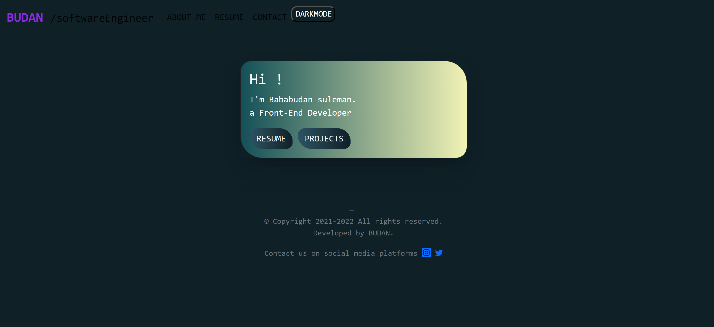

# Demo-Botstrap-port

#### This project is a simple portfolio webpage designed for practice purposes. The webpage showcases a responsive design and incorporates various styles and features using HTML, CSS, and JavaScript.

##  Brief overview of the project structure and functionalities

## Project Structure:

 HTML File (index.html):

- The main HTML file defines the structure of the webpage.
- It includes metadata such as character set, viewport settings, and a link to the Bootstrap CSS framework.
- The FontAwesome library is linked for access to icon fonts.
- The body of the HTML file contains the content of the webpage, including navigation, cards, and a footer.
{ width="100px" }
## CSS Styling (style):
- Custom Responsive mobile view for different mobile devices.
{ width="100px" }
- Custom styles are defined within the style tags in the HTML file.
- The styles include background gradients, card styling, button styling, and color schemes to enhance the visual appeal of the webpage.

## Navigation Bar:

- A responsive navigation bar is implemented using Bootstrap components.
- It includes links to different sections of the portfolio such as "ABOUT ME," "RESUME," and "CONTACT."
{ width="100px" }
- A "DARKMODE" button is provided to toggle a dark mode feature.
{ width="100px" }
## Footer:

- A simple footer is included at the bottom of the webpage.
- It displays copyright information and a note indicating that the webpage was developed by BUDAN.
- Social media icons (Instagram and Twitter) are linked in the footer for contact purposes.

## JavaScript Functionality:

- JavaScript is used to implement a dark mode toggle. Clicking the "DARKMODE" button toggles the 'made' class on the body, changing the color scheme for a dark mode experience.

## How to Use:
- Clone the repository or download the HTML file and associated styles.
- Open the index.html file in a web browser to view the portfolio webpage.
- Explore the navigation links, card content, and the dark mode toggle feature.
- Feel free to customize the content, styling, and structure of the webpage to fit your own portfolio or practice needs.

## Dependencies:
Bootstrap CSS: Included for responsive design and styling.
FontAwesome: Used for incorporating social media icons.